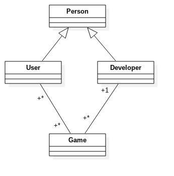

#Project Plan
------

**1. Team**

660835 Laxmi Thebe
643645 Filippo Vimini
428514 Carl Bostrom

**2. Goal**

In this project, we will create a simple but functional website that allows to play and sell games. Developer will be able to link their games into the website and set a price for the sell. Gamers will be able to buy the games and play directly in the website. The Website will create a game library for each user and collects some basic statistics about the games.  

**3. Plans**

Our initial focus go to the backend in order to create the structures which allow the website to run.  

*   Backend
    *   documentation and logging
    *   models
        *   person
        *   player
        *   developer
        *   game
    *   Authentication
    *   upload game
    *   buy game
    *   play game
    *   Search
*   Frontend
    *   Home
    *   Login
    *   Developer
    *   Gamer

**ER-Diagram**

The diagram is more about the concept and actual representation of the relationship than exact definition of attributes.

The test and the security will be implemented while proper fnctionalities are created.

**4. Process and Time Schedule**

We communicate using the messagging application Slack. Most work will be done remotely due to divergent schedules of teammates.

* 25.12-30.12:
  Development begins. We set up logging and documentation system and begin working on the backend, starting with authentication.
* 1.1-21.1:
  We begin work on the frontend design, with continuous testing on phone. Most core features should be implemented during this time.
* 28.1-5.2:
  Polish for the frontend. The payment system should be implemented this week. If time permits we begin implementing tag system here.
* 5.2-20.2:
  Assuming everything else works we use this time to implement extra features.

**5. Testing**

The backend will have tests for all views and all response cases. For the frontend we will use AVA. To ensure code quality we require all features must have unit tests before merging to master.

**6. Risk Analysis**

